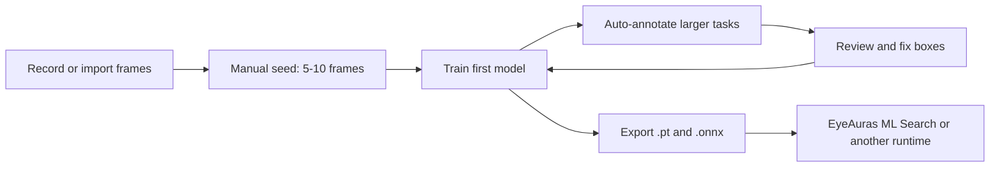

# YoloEase

YoloEase is a desktop app for building YOLO object-detection models in short feedback loops.

Start with a handful of manually annotated frames, get the first model quickly, then use that model to annotate larger batches. After a few iterations, most of the work becomes reviewing and fixing model suggestions instead of drawing every box from scratch.

The result is a normal YOLO model: `.pt` weights for further training and `.onnx` weights for runtime use. EyeAuras `ML Search` is the main integration shown here, but the exported ONNX model is not EyeAuras-specific.

## Managed Training Setup

YoloEase v2 removes most of the old environment setup chores. You do not have to start by installing Python, PyTorch, Ultralytics, CUDA packages, or ONNX export tools by hand.

Open the `Prerequisites` tab, run `Check all`, then press `Install missing`. YoloEase manages:

- portable Python for local training;
- the project Python environment;
- package installation tools;
- PyTorch CPU or CUDA runtime;
- Ultralytics YOLO CLI;
- ONNX export and runtime tooling;
- NVIDIA GPU detection and acceleration checks.

If something goes wrong, the same page shows per-component diagnostics and copyable logs.

## Why It Exists

Training a useful detector is rarely a one-shot process. You collect real frames, label a small part, train, inspect mistakes, add the frames where the model failed, and repeat. YoloEase keeps that loop inside one project:

- create `.yeproj` projects with project-owned training assets;
- prepare the local training environment from the `Prerequisites` tab;
- import images, folders, or videos;
- extract frames from screen recordings;
- define labels and annotate tasks in the built-in editor;
- train locally or prepare a Google Colab run;
- preview predictions from the latest model;
- use prediction-assisted annotation for the next tasks;
- export `.pt` and `.onnx` files after training.

## Screenshots

| Prerequisites | Prepare data | Annotate |
| --- | --- | --- |
|  |  |  |

| Extract frames | Train | Inspect metrics |
| --- | --- | --- |
|  |  |  |

| Inspect predictions | Improve with auto-annotation | Use the model |
| --- | --- | --- |
|  |  |  |

## Typical Workflow

1. Download the latest build from [GitHub releases](https://github.com/iXab3r/YoloEase/releases/).
2. Create a new `.yeproj` project.
3. Open `Prerequisites`, run `Check all`, then `Install missing` if needed.
4. Add labels such as `target`, `button`, `enemy`, or any classes your automation needs.
5. Add images, folders, or a video recording.
6. Extract frames from video if needed.
7. Annotate the first small task manually and click `Finish Job`.
8. Start training.
9. Use the latest model to auto-annotate larger tasks.
10. Review mistakes, finish the task, and train the next model generation.
11. Use the final `.onnx` in EyeAuras `ML Search` or another compatible runtime.

## Training Modes

**Local Training** runs on your machine. YoloEase manages a portable Python environment, Python packages, PyTorch, Ultralytics, and ONNX tooling from the `Prerequisites` tab.

**Google Colab** is available when you want to train outside your local machine. YoloEase prepares the dataset archive, and you bring the trained model back into the project.

## Example Output

After training, `Open` on a model run takes you to the output folder with model weights and training artifacts.

Common files:

- `best.pt` - best PyTorch weights from the run;
- `last.pt` - weights from the last epoch;
- `.onnx` - exported model for runtime inference;
- `results.png` and `results.csv` - training metrics;
- `data.yaml` - YOLO dataset description used for the run.

## Quick Links

- [Download latest release](https://github.com/iXab3r/YoloEase/releases/)
- [Russian getting started guide](https://wiki.eyeauras.net/ru/YoloEase/getting-started)
- [Prerequisites guide](https://wiki.eyeauras.net/ru/YoloEase/prerequisites)
- [Data sources guide](https://wiki.eyeauras.net/ru/YoloEase/features/data-sources)
- [Annotation editor guide](https://wiki.eyeauras.net/ru/YoloEase/features/annotation-editor)
- [Trainer guide](https://wiki.eyeauras.net/ru/YoloEase/features/trainer)
- [EyeAuras integration guide](https://wiki.eyeauras.net/ru/YoloEase/features/eyeauras-integration)

## Demo Assets

- [Recorded demo session](https://youtu.be/MdLETBZPeec)
- [Ready-to-use EyeAuras pack](https://eyeauras.net/share/S20260507232328uRAOxLRumL6o)
- [ONNX weights](https://s3.eyeauras.net/media/2026/05/Qwe_yolo11s_202605072245262GXYDdJshE3b.onnx)
- [PyTorch weights](https://s3.eyeauras.net/media/2026/05/Qwe_yolo11s_202605072245262GXYDdJshE3b.pt)
- [Full YoloEase project with training history](https://s3.eyeauras.net/media/2026/05/AimTrainerDemo.zip)

## EyeAuras Example

In the demo project, YoloEase trains a detector for AimTrainer.io. EyeAuras then loads the exported ONNX model in `ML Search`, uses a Behavior Tree to select targets, avoids clicking when the restart button is visible, and filters out tiny false detections.

YoloEase is still evolving quickly. Please report problems or suggestions through the app or the repository issues.
